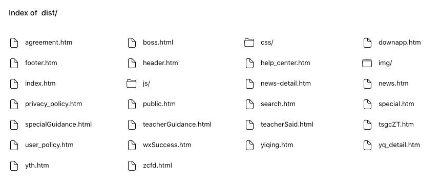

# @gzteacher/cms-server

<p>
  <a href="https://www.npmjs.com/package/@gzteacher/cms-server">
    
  </a>
  <a href="https://github.com/yyz945947732/gzteacher-cms-server/pulls">
    
  </a>
  <a href="/LICENSE.md">
    
  </a>
</p>

<h2>⚠️ 大部分 cms 语法并不支持，仅以调试静态文件为主 ⚠️</h2>

🚀 本地运行 cms 文件的服务

- 支持热更新
- 自动打开浏览器
- 自动替换 cms 语法
- 支持 include 嵌套

## Quick start

本地安装

```sh
npm install -D @gzteacher/cms-server
```

`package.json` 文件添加以下命令:

```json
"scripts": {
  "start": "cms-run"
}
```

现在，你可以本地运行服务调试文件了。

```bash
npm run start
```



## LICENSE

[MIT](https://github.com/yyz945947732/@gzteacher/cms-server/blob/master/LICENSE)

---

This project is created using [generator-stupid-cli](https://github.com/yyz945947732/generator-stupid-cli).
